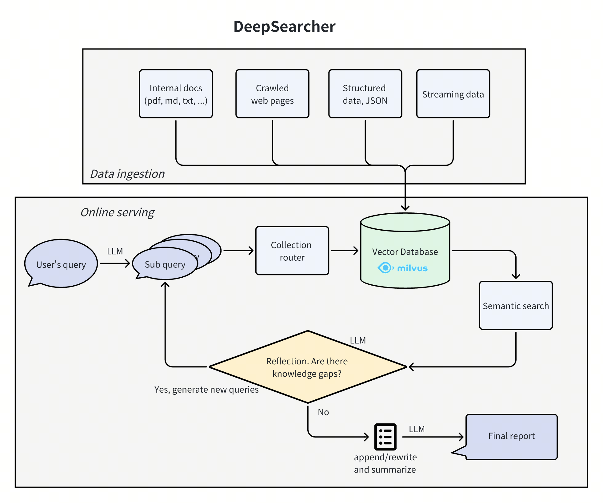
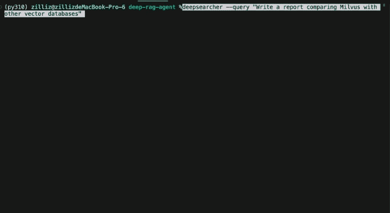

<div align="center">
  
[](https://opensource.org/licenses/Apache-2.0)
[](https://twitter.com/zilliz_universe)
<a href="https://discord.gg/mKc3R95yE5"></a>

</div>

---

DeepSearcher combines cutting-edge LLMs (OpenAI o1, o3-mini, DeepSeek, Grok 3, Claude 3.7 Sonnet, Llama 4, QwQ, etc.) and Vector Databases (Milvus, Zilliz Cloud etc.) to perform search, evaluation, and reasoning based on private data, providing highly accurate answer and comprehensive report. This project is suitable for enterprise knowledge management, intelligent Q&A systems, and information retrieval scenarios.



## 🚀 Features

- **Private Data Search**: Maximizes the utilization of enterprise internal data while ensuring data security. When necessary, it can integrate online content for more accurate answers.
- **Vector Database Management**: Supports Milvus and other vector databases, allowing data partitioning for efficient retrieval.
- **Flexible Embedding Options**: Compatible with multiple embedding models for optimal selection.
- **Multiple LLM Support**: Supports DeepSeek, OpenAI, and other large models for intelligent Q&A and content generation.
- **Document Loader**: Supports local file loading, with web crawling capabilities under development.

---

## 🎉 Demo



## 📖 Quick Start

### Installation
Install DeepSearcher using one of the following methods:

#### Option 1: Using pip
Create and activate a virtual environment(Python 3.10 version is recommended).
```bash
python -m venv .venv
source .venv/bin/activate
```
Install DeepSearcher
```bash
pip install deepsearcher
```

For optional dependencies, e.g., ollama:
```bash
pip install "deepsearcher[ollama]"
```

#### Option 2: Install in Development Mode
We recommend using [uv](https://github.com/astral-sh/uv) for faster and more reliable installation. Follow the [offical installation instructions](https://docs.astral.sh/uvgetting-started/installation/) to install it.

Clone the repository and navigate to the project directory:
```shell
git clone https://github.com/zilliztech/deep-searcher.git && cd deep-searcher
```
Synchronize and install dependencies:
```shell
uv sync
source .venv/bin/activate
```

For more detailed development setup and optional dependency installation options, see [CONTRIBUTING.md](CONTRIBUTING.md#development-environment-setup-with-uv).

### Quick start demo

To run this quick start demo, please prepare your `OPENAI_API_KEY` in your environment variables. If you change the LLM in the configuration, make sure to prepare the corresponding API key.

```python
from deepsearcher.configuration import Configuration, init_config
from deepsearcher.online_query import query

config = Configuration()

# Customize your config here,
# more configuration see the Configuration Details section below.
config.set_provider_config("llm", "OpenAI", {"model": "o1-mini"})
config.set_provider_config("embedding", "OpenAIEmbedding", {"model": "text-embedding-ada-002"})
init_config(config = config)

# Load your local data
from deepsearcher.offline_loading import load_from_local_files
load_from_local_files(paths_or_directory=your_local_path)

# (Optional) Load from web crawling (`FIRECRAWL_API_KEY` env variable required)
from deepsearcher.offline_loading import load_from_website
load_from_website(urls=website_url)

# Query
result = query("Write a report about xxx.") # Your question here
```
### Configuration Details:
#### LLM Configuration

<pre><code>config.set_provider_config("llm", "(LLMName)", "(Arguments dict)")</code></pre>
<p>The "LLMName" can be one of the following: ["DeepSeek", "OpenAI", "XAI", "SiliconFlow", "PPIO", "TogetherAI", "Gemini", "Ollama", "Novita"]</p>
<p> The "Arguments dict" is a dictionary that contains the necessary arguments for the LLM class.</p>

<details>
  <summary>Example (OpenAI)</summary>
    <p> Make sure you have prepared your OPENAI API KEY as an env variable <code>OPENAI_API_KEY</code>.</p>
    <pre><code>config.set_provider_config("llm", "OpenAI", {"model": "o1-mini"})</code></pre>
    <p> More details about OpenAI models: https://platform.openai.com/docs/models </p>
</details>

<details>
  <summary>Example (DeepSeek from official)</summary>
    <p> Make sure you have prepared your DEEPSEEK API KEY as an env variable <code>DEEPSEEK_API_KEY</code>.</p>
    <pre><code>config.set_provider_config("llm", "DeepSeek", {"model": "deepseek-reasoner"})</code></pre>
    <p> More details about DeepSeek: https://api-docs.deepseek.com/ </p>
</details>

<details>
  <summary>Example (DeepSeek from SiliconFlow)</summary>
    <p> Make sure you have prepared your SILICONFLOW API KEY as an env variable <code>SILICONFLOW_API_KEY</code>.</p>
    <pre><code>config.set_provider_config("llm", "SiliconFlow", {"model": "deepseek-ai/DeepSeek-R1"})</code></pre>
    <p> More details about SiliconFlow: https://docs.siliconflow.cn/quickstart </p>
</details>

<details>
  <summary>Example (DeepSeek from TogetherAI)</summary>
    <p> Make sure you have prepared your TOGETHER API KEY as an env variable <code>TOGETHER_API_KEY</code>.</p>
    For deepseek R1:
    <pre><code>config.set_provider_config("llm", "TogetherAI", {"model": "deepseek-ai/DeepSeek-R1"})</code></pre>
    For Llama 4:
    <pre><code>config.set_provider_config("llm", "TogetherAI", {"model": "meta-llama/Llama-4-Scout-17B-16E-Instruct"})</code></pre>
    <p> You need to install together before running, execute: <code>pip install together</code>. More details about TogetherAI: https://www.together.ai/ </p>
</details>

<details>
  <summary>Example (XAI Grok)</summary>
    <p> Make sure you have prepared your XAI API KEY as an env variable <code>XAI_API_KEY</code>.</p>
    <pre><code>config.set_provider_config("llm", "XAI", {"model": "grok-2-latest"})</code></pre>
    <p> More details about XAI Grok: https://docs.x.ai/docs/overview#featured-models </p>
</details>

<details>
  <summary>Example (Claude)</summary>
    <p> Make sure you have prepared your ANTHROPIC API KEY as an env variable <code>ANTHROPIC_API_KEY</code>.</p>
    <pre><code>config.set_provider_config("llm", "Anthropic", {"model": "claude-3-7-sonnet-latest"})</code></pre>
    <p> More details about Anthropic Claude: https://docs.anthropic.com/en/home </p>
</details>

<details>
  <summary>Example (Google Gemini)</summary>
    <p> Make sure you have prepared your GEMINI API KEY as an env variable <code>GEMINI_API_KEY</code>.</p>
    <pre><code>config.set_provider_config('llm', 'Gemini', { 'model': 'gemini-2.0-flash' })</code></pre>
    <p> You need to install gemini before running, execute: <code>pip install google-genai</code>. More details about Gemini: https://ai.google.dev/gemini-api/docs </p>
</details>

<details>
  <summary>Example (DeepSeek from PPIO)</summary>
    <p> Make sure you have prepared your PPIO API KEY as an env variable <code>PPIO_API_KEY</code>. You can create an API Key <a href="https://ppinfra.com/settings/key-management?utm_source=github_deep-searcher">here</a>. </p>
    <pre><code>config.set_provider_config("llm", "PPIO", {"model": "deepseek/deepseek-r1-turbo"})</code></pre>
    <p> More details about PPIO: https://ppinfra.com/docs/get-started/quickstart.html?utm_source=github_deep-searcher </p>
</details>

<details>
  <summary>Example (Ollama)</summary>
  <p> Follow <a href="https://github.com/jmorganca/ollama">these instructions</a> to set up and run a local Ollama instance:</p>
  <p> <a href="https://ollama.ai/download">Download</a> and install Ollama onto the available supported platforms (including Windows Subsystem for Linux).</p>
  <p> View a list of available models via the <a href="https://ollama.ai/library">model library</a>.</p>
  <p> Fetch available LLM models via <code>ollama pull &lt;name-of-model&gt;</code></p>
  <p> Example: <code>ollama pull qwq</code></p>
  <p> To chat directly with a model from the command line, use <code>ollama run &lt;name-of-model&gt;</code>.</p>
  <p> By default, Ollama has a REST API for running and managing models on <a href="http://localhost:11434">http://localhost:11434</a>.</p>
  <pre><code>config.set_provider_config("llm", "Ollama", {"model": "qwq"})</code></pre>
</details>

<details>
  <summary>Example (Volcengine)</summary>
    <p> Make sure you have prepared your Volcengine API KEY as an env variable <code>VOLCENGINE_API_KEY</code>. You can create an API Key <a href="https://console.volcengine.com/ark/region:ark+cn-beijing/apiKey">here</a>. </p>
    <pre><code>config.set_provider_config("llm", "Volcengine", {"model": "deepseek-r1-250120"})</code></pre>
    <p> More details about Volcengine: https://www.volcengine.com/docs/82379/1099455?utm_source=github_deep-searcher </p>
</details>

<details>
  <summary>Example (GLM)</summary>
    <p> Make sure you have prepared your GLM API KEY as an env variable <code>GLM_API_KEY</code>.</p>
    <pre><code>config.set_provider_config("llm", "GLM", {"model": "glm-4-plus"})</code></pre>
    <p> You need to install zhipuai before running, execute: <code>pip install zhipuai</code>. More details about GLM: https://bigmodel.cn/dev/welcome </p>
</details>

<details>
  <summary>Example (Amazon Bedrock)</summary>
    <p> Make sure you have prepared your Amazon Bedrock API KEY as an env variable <code>AWS_ACCESS_KEY_ID</code> and <code>AWS_SECRET_ACCESS_KEY</code>.</p>
    <pre><code>config.set_provider_config("llm", "Bedrock", {"model": "us.deepseek.r1-v1:0"})</code></pre>
    <p> You need to install boto3 before running, execute: <code>pip install boto3</code>. More details about Amazon Bedrock: https://docs.aws.amazon.com/bedrock/ </p>
</details>

<details>
  <summary>Example (Aliyun Bailian)</summary>
    <p> Make sure you have prepared your Bailian API KEY as an env variable <code>DASHSCOPE_API_KEY</code>.</p>
    <pre><code>config.set_provider_config("llm", "Aliyun", {"model": "deepseek-r1"})</code></pre>
    <p> More details about Aliyun Bailian models: https://bailian.console.aliyun.com </p>
</details>

#### Embedding Model Configuration
<pre><code>config.set_provider_config("embedding", "(EmbeddingModelName)", "(Arguments dict)")</code></pre>
<p>The "EmbeddingModelName" can be one of the following: ["MilvusEmbedding", "OpenAIEmbedding", "VoyageEmbedding", "SiliconflowEmbedding", "PPIOEmbedding", "NovitaEmbedding"]</p>
<p> The "Arguments dict" is a dictionary that contains the necessary arguments for the embedding model class.</p>

<details>
  <summary>Example (OpenAI embedding)</summary>
    <p> Make sure you have prepared your OpenAI API KEY as an env variable <code>OPENAI_API_KEY</code>.</p>
    <pre><code>config.set_provider_config("embedding", "OpenAIEmbedding", {"model": "text-embedding-3-small"})</code></pre>
    <p> More details about OpenAI models: https://platform.openai.com/docs/guides/embeddings/use-cases </p>
</details>

<details>
  <summary>Example (Pymilvus built-in embedding model)</summary>
    <p> Use the built-in embedding model in Pymilvus, you can set the model name as <code>"default"</code>, <code>"BAAI/bge-base-en-v1.5"</code>, <code>"BAAI/bge-large-en-v1.5"</code>, <code>"jina-embeddings-v3"</code>, etc. <br/>
    See [milvus_embedding.py](deepsearcher/embedding/milvus_embedding.py) for more details.  </p>
    <pre><code>config.set_provider_config("embedding", "MilvusEmbedding", {"model": "BAAI/bge-base-en-v1.5"})</code></pre>
    <pre><code>config.set_provider_config("embedding", "MilvusEmbedding", {"model": "jina-embeddings-v3"})</code></pre>
    <p> For Jina's embedding model, you need<code>JINAAI_API_KEY</code>.</p>
    <p> You need to install pymilvus model before running, execute: <code>pip install pymilvus.model</code>. More details about Pymilvus: https://milvus.io/docs/embeddings.md </p>

</details>

<details>
  <summary>Example (VoyageAI embedding)</summary>
    <p> Make sure you have prepared your VOYAGE API KEY as an env variable <code>VOYAGE_API_KEY</code>.</p>
    <pre><code>config.set_provider_config("embedding", "VoyageEmbedding", {"model": "voyage-3"})</code></pre>
    <p> You need to install voyageai before running, execute: <code>pip install voyageai</code>. More details about VoyageAI: https://docs.voyageai.com/embeddings/ </p>
</details>

<details>
  <summary>Example (Amazon Bedrock embedding)</summary>
  <pre><code>config.set_provider_config("embedding", "BedrockEmbedding", {"model": "amazon.titan-embed-text-v2:0"})</code></pre>
  <p> You need to install boto3 before running, execute: <code>pip install boto3</code>. More details about Amazon Bedrock: https://docs.aws.amazon.com/bedrock/ </p>
</details>

<details>
  <summary>Example (Novita AI embedding)</summary>
    <p> Make sure you have prepared your Novita AI API KEY as an env variable <code>NOVITA_API_KEY</code>.</p>
    <pre><code>config.set_provider_config("embedding", "NovitaEmbedding", {"model": "baai/bge-m3"})</code></pre>
    <p> More details about Novita AI: https://novita.ai/docs/api-reference/model-apis-llm-create-embeddings?utm_source=github_deep-searcher&utm_medium=github_readme&utm_campaign=link </p>
</details>

<details>
  <summary>Example (Siliconflow embedding)</summary>
    <p> Make sure you have prepared your Siliconflow API KEY as an env variable <code>SILICONFLOW_API_KEY</code>.</p>
    <pre><code>config.set_provider_config("embedding", "SiliconflowEmbedding", {"model": "BAAI/bge-m3"})</code></pre>
    <p> More details about Siliconflow: https://docs.siliconflow.cn/en/api-reference/embeddings/create-embeddings </p>
</details>

<details>
  <summary>Example (Volcengine embedding)</summary>
    <p> Make sure you have prepared your Volcengine API KEY as an env variable <code>VOLCENGINE_API_KEY</code>.</p>
    <pre><code>config.set_provider_config("embedding", "VolcengineEmbedding", {"model": "doubao-embedding-text-240515"})</code></pre>
    <p> More details about Volcengine: https://www.volcengine.com/docs/82379/1302003 </p>
</details>

<details>
  <summary>Example (GLM embedding)</summary>
    <p> Make sure you have prepared your GLM API KEY as an env variable <code>GLM_API_KEY</code>.</p>
    <pre><code>config.set_provider_config("embedding", "GLMEmbedding", {"model": "embedding-3"})</code></pre>
    <p> You need to install zhipuai before running, execute: <code>pip install zhipuai</code>. More details about GLM: https://bigmodel.cn/dev/welcome </p>
</details>

<details>
  <summary>Example (Google Gemini embedding)</summary>
    <p> Make sure you have prepared your Gemini API KEY as an env variable <code>GEMINI_API_KEY</code>.</p>
    <pre><code>config.set_provider_config("embedding", "GeminiEmbedding", {"model": "text-embedding-004"})</code></pre>
    <p> You need to install gemini before running, execute: <code>pip install google-genai</code>. More details about Gemini: https://ai.google.dev/gemini-api/docs </p>
</details>

<details>
  <summary>Example (Ollama embedding)</summary>
    <pre><code>config.set_provider_config("embedding", "OllamaEmbedding", {"model": "bge-m3"})</code></pre>
    <p> You need to install ollama before running, execute: <code>pip install ollama</code>. More details about Ollama Python SDK: https://github.com/ollama/ollama-python </p>
</details>

<details>
  <summary>Example (PPIO embedding)</summary>
    <p> Make sure you have prepared your PPIO API KEY as an env variable <code>PPIO_API_KEY</code>.</p>
    <pre><code>config.set_provider_config("embedding", "PPIOEmbedding", {"model": "baai/bge-m3"})</code></pre>
    <p> More details about PPIO: https://ppinfra.com/docs/get-started/quickstart.html?utm_source=github_deep-searcher </p>
</details>


#### Vector Database Configuration
<pre><code>config.set_provider_config("vector_db", "(VectorDBName)", "(Arguments dict)")</code></pre>
<p>The "VectorDBName" can be one of the following: ["Milvus"] (Under development)</p>
<p> The "Arguments dict" is a dictionary that contains the necessary arguments for the Vector Database class.</p>

<details>
  <summary>Example (Milvus)</summary>
    <pre><code>config.set_provider_config("vector_db", "Milvus", {"uri": "./milvus.db", "token": ""})</code></pre>
    <p> More details about Milvus Config:</p>
    <ul>
        <li>
            Setting the <code>uri</code> as a local file, e.g. <code>./milvus.db</code>, is the most convenient method, as it automatically utilizes <a href="https://milvus.io/docs/milvus_lite.md" target="_blank">Milvus Lite</a> to store all data in this file.
        </li>
    </ul>
    <ul>
      <li>
          If you have a large-scale dataset, you can set up a more performant Milvus server using 
          <a href="https://milvus.io/docs/quickstart.md" target="_blank">Docker or Kubernetes</a>. 
          In this setup, use the server URI, e.g., <code>http://localhost:19530</code>, as your <code>uri</code>.
        </li>
    </ul>
    <ul>
        <li>
            If you want to use <a href="https://zilliz.com/cloud" target="_blank">Zilliz Cloud</a>, 
            the fully managed cloud service for Milvus, adjust the <code>uri</code> and <code>token</code> 
            according to the <a href="https://docs.zilliz.com/docs/on-zilliz-cloud-console#free-cluster-details" 
            target="_blank">Public Endpoint and API Key</a> in Zilliz Cloud.
        </li>
    </ul>

</details>

#### File Loader Configuration
<pre><code>config.set_provider_config("file_loader", "(FileLoaderName)", "(Arguments dict)")</code></pre>
<p>The "FileLoaderName" can be one of the following: ["PDFLoader", "TextLoader", "UnstructuredLoader"]</p>
<p> The "Arguments dict" is a dictionary that contains the necessary arguments for the File Loader class.</p>

<details>
  <summary>Example (Unstructured)</summary>
    <p>You can use Unstructured in two ways:</p>
    <ul>
      <li>With API: Set environment variables <code>UNSTRUCTURED_API_KEY</code> and <code>UNSTRUCTURED_API_URL</code></li>
      <li>Without API: Use the local processing mode by simply not setting these environment variables</li>
    </ul>
    <pre><code>config.set_provider_config("file_loader", "UnstructuredLoader", {})</code></pre>
    <ul>
      <li>Currently supported file types: ["pdf"] (Under development)</li>
      <li>Installation requirements:
        <ul>
          <li>Install ingest pipeline: <code>pip install unstructured-ingest</code></li>
          <li>For all document formats: <code>pip install "unstructured[all-docs]"</code></li>
          <li>For specific formats (e.g., PDF only): <code>pip install "unstructured[pdf]"</code></li>
        </ul>
      </li>
      <li>More information:
        <ul>
          <li>Unstructured documentation: <a href="https://docs.unstructured.io/ingestion/overview">https://docs.unstructured.io/ingestion/overview</a></li>
          <li>Installation guide: <a href="https://docs.unstructured.io/open-source/installation/full-installation">https://docs.unstructured.io/open-source/installation/full-installation</a></li>
        </ul>
      </li>
    </ul>
</details>

<details>
  <summary>Example (Docling)</summary>
    <pre><code>config.set_provider_config("file_loader", "DoclingLoader", {})</code></pre>
    <p> Currently supported file types: please refer to the Docling documentation: https://docling-project.github.io/docling/usage/supported_formats/#supported-output-formats </p>
    <p> You need to install docling before running, execute: <code>pip install docling</code>. More details about Docling: https://docling-project.github.io/docling/ </p>
</details>

#### Web Crawler Configuration
<pre><code>config.set_provider_config("web_crawler", "(WebCrawlerName)", "(Arguments dict)")</code></pre>
<p>The "WebCrawlerName" can be one of the following: ["FireCrawlCrawler", "Crawl4AICrawler", "JinaCrawler"]</p>
<p> The "Arguments dict" is a dictionary that contains the necessary arguments for the Web Crawler class.</p>

<details>
  <summary>Example (FireCrawl)</summary>
    <p> Make sure you have prepared your FireCrawl API KEY as an env variable <code>FIRECRAWL_API_KEY</code>.</p>
    <pre><code>config.set_provider_config("web_crawler", "FireCrawlCrawler", {})</code></pre>
    <p> More details about FireCrawl: https://docs.firecrawl.dev/introduction </p>
</details>

<details>
  <summary>Example (Crawl4AI)</summary>
    <p> Make sure you have run <code>crawl4ai-setup</code> in your environment.</p>
    <pre><code>config.set_provider_config("web_crawler", "Crawl4AICrawler", {"browser_config": {"headless": True, "verbose": True}})</code></pre>
    <p> You need to install crawl4ai before running, execute: <code>pip install crawl4ai</code>. More details about Crawl4AI: https://docs.crawl4ai.com/ </p>
</details>

<details>
  <summary>Example (Jina Reader)</summary>
    <p> Make sure you have prepared your Jina Reader API KEY as an env variable <code>JINA_API_TOKEN</code> or <code>JINAAI_API_KEY</code>.</p>
    <pre><code>config.set_provider_config("web_crawler", "JinaCrawler", {})</code></pre>
    <p> More details about Jina Reader: https://jina.ai/reader/ </p>
</details>

<details>
  <summary>Example (Docling)</summary>
    <pre><code>config.set_provider_config("web_crawler", "DoclingCrawler", {})</code></pre>
    <p> Currently supported file types: please refer to the Docling documentation: https://docling-project.github.io/docling/usage/supported_formats/#supported-output-formats </p>
    <p> You need to install docling before running, execute: <code>pip install docling</code>. More details about Docling: https://docling-project.github.io/docling/ </p>
</details>


### Python CLI Mode
#### Load
```shell
deepsearcher load "your_local_path_or_url"
# load into a specific collection
deepsearcher load "your_local_path_or_url" --collection_name "your_collection_name" --collection_desc "your_collection_description"
```
Example loading from local file:
```shell
deepsearcher load "/path/to/your/local/file.pdf"
# or more files at once
deepsearcher load "/path/to/your/local/file1.pdf" "/path/to/your/local/file2.md"
```
Example loading from url (*Set `FIRECRAWL_API_KEY` in your environment variables, see [FireCrawl](https://docs.firecrawl.dev/introduction) for more details*):

```shell
deepsearcher load "https://www.wikiwand.com/en/articles/DeepSeek"
```

#### Query
```shell
deepsearcher query "Write a report about xxx."
```

More help information
```shell
deepsearcher --help
```
For more help information about a specific subcommand, you can use `deepsearcher [subcommand] --help`.
```shell
deepsearcher load --help
deepsearcher query --help
```

### Deployment

#### Configure modules

You can configure all arguments by modifying [config.yaml](./config.yaml) to set up your system with default modules.
For example, set your `OPENAI_API_KEY` in the `llm` section of the YAML file.

#### Start service
The main script will run a FastAPI service with default address `localhost:8000`.

```shell
$ python main.py
```

#### Access via browser

You can open url http://localhost:8000/docs in browser to access the web service.
Click on the button "Try it out", it allows you to fill the parameters and directly interact with the API.


---

## ❓ Q&A

**Q1**: Why I failed to parse LLM output format / How to select the LLM?


**A1**: Small LLMs struggle to follow the prompt to generate a desired response, which usually cause the format parsing problem. A better practice is to use large reasoning models e.g. deepseek-r1 671b, OpenAI o-series, Claude 3.7 sonnet, etc. as your LLM. 

---

**Q2**: 
OSError: We couldn't connect to 'https://huggingface.co' to load this file, couldn't find it in the cached files and it looks like GPTCache/paraphrase-albert-small-v2 is not the path to a directory containing a file named config.json.
Checkout your internet connection or see how to run the library in offline mode at 'https://huggingface.co/docs/transformers/installation#offline-mode'.

**A2**: This is mainly due to abnormal access to huggingface, which may be a network or permission problem. You can try the following two methods:
1. If there is a network problem, set up a proxy, try adding the following environment variable.
```bash
export HF_ENDPOINT=https://hf-mirror.com
```
2. If there is a permission problem, set up a personal token, try adding the following environment variable.
```bash
export HUGGING_FACE_HUB_TOKEN=xxxx
```

---

**Q3**: DeepSearcher doesn't run in Jupyter notebook.

**A3**: Install `nest_asyncio` and then put this code block in front of your jupyter notebook.

```
pip install nest_asyncio
```

```
import nest_asyncio
nest_asyncio.apply()
```

---

## 🔧 Module Support

### 🔹 Embedding Models
- [Open-source embedding models](https://milvus.io/docs/embeddings.md)
- [OpenAI](https://platform.openai.com/docs/guides/embeddings/use-cases) (`OPENAI_API_KEY` env variable required)
- [VoyageAI](https://docs.voyageai.com/embeddings/) (`VOYAGE_API_KEY` env variable required)
- [Amazon Bedrock](https://docs.aws.amazon.com/bedrock/) (`AWS_ACCESS_KEY_ID` and `AWS_SECRET_ACCESS_KEY` env variable required)
- [FastEmbed](https://qdrant.github.io/fastembed/)
- [PPIO](https://ppinfra.com/model-api/product/llm-api?utm_source=github_deep-searcher) (`PPIO_API_KEY` env variable required)
- [Novita AI](https://novita.ai/docs/api-reference/model-apis-llm-create-embeddings?utm_source=github_deep-searcher&utm_medium=github_readme&utm_campaign=link) (`NOVITA_API_KEY` env variable required)

### 🔹 LLM Support
- [OpenAI](https://platform.openai.com/docs/models) (`OPENAI_API_KEY` env variable required)
- [DeepSeek](https://api-docs.deepseek.com/) (`DEEPSEEK_API_KEY` env variable required)
- [XAI Grok](https://x.ai/blog/grok-3) (`XAI_API_KEY` env variable required)
- [Anthropic Claude](https://docs.anthropic.com/en/home) (`ANTHROPIC_API_KEY` env variable required)
- [SiliconFlow Inference Service](https://docs.siliconflow.cn/en/userguide/introduction) (`SILICONFLOW_API_KEY` env variable required)
- [PPIO](https://ppinfra.com/model-api/product/llm-api?utm_source=github_deep-searcher) (`PPIO_API_KEY` env variable required)
- [TogetherAI Inference Service](https://docs.together.ai/docs/introduction) (`TOGETHER_API_KEY` env variable required)
- [Google Gemini](https://ai.google.dev/gemini-api/docs) (`GEMINI_API_KEY` env variable required)
- [SambaNova Cloud Inference Service](https://docs.together.ai/docs/introduction) (`SAMBANOVA_API_KEY` env variable required)
- [Ollama](https://ollama.com/)
- [Novita AI](https://novita.ai/docs/guides/introduction?utm_source=github_deep-searcher&utm_medium=github_readme&utm_campaign=link) (`NOVITA_API_KEY` env variable required)

### 🔹 Document Loader
- Local File
  - PDF(with txt/md) loader
  - [Unstructured](https://unstructured.io/) (under development) (`UNSTRUCTURED_API_KEY` and `UNSTRUCTURED_URL` env variables required)
- Web Crawler
  - [FireCrawl](https://docs.firecrawl.dev/introduction) (`FIRECRAWL_API_KEY` env variable required)
  - [Jina Reader](https://jina.ai/reader/) (`JINA_API_TOKEN` env variable required)
  - [Crawl4AI](https://docs.crawl4ai.com/) (You should run command `crawl4ai-setup` for the first time)

### 🔹 Vector Database Support
- [Milvus](https://milvus.io/) and [Zilliz Cloud](https://www.zilliz.com/) (fully managed Milvus)
- [Qdrant](https://qdrant.tech/)

---
## 📊 Evaluation 
See the [Evaluation](./evaluation) directory for more details.

---
## 📌 Future Plans
- Enhance web crawling functionality
- Support more vector databases (e.g., FAISS...)
- Add support for additional large models
- Provide RESTful API interface (**DONE**)

We welcome contributions! Star & Fork the project and help us build a more powerful DeepSearcher! 🎯
