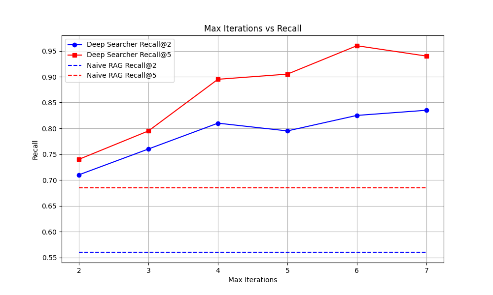
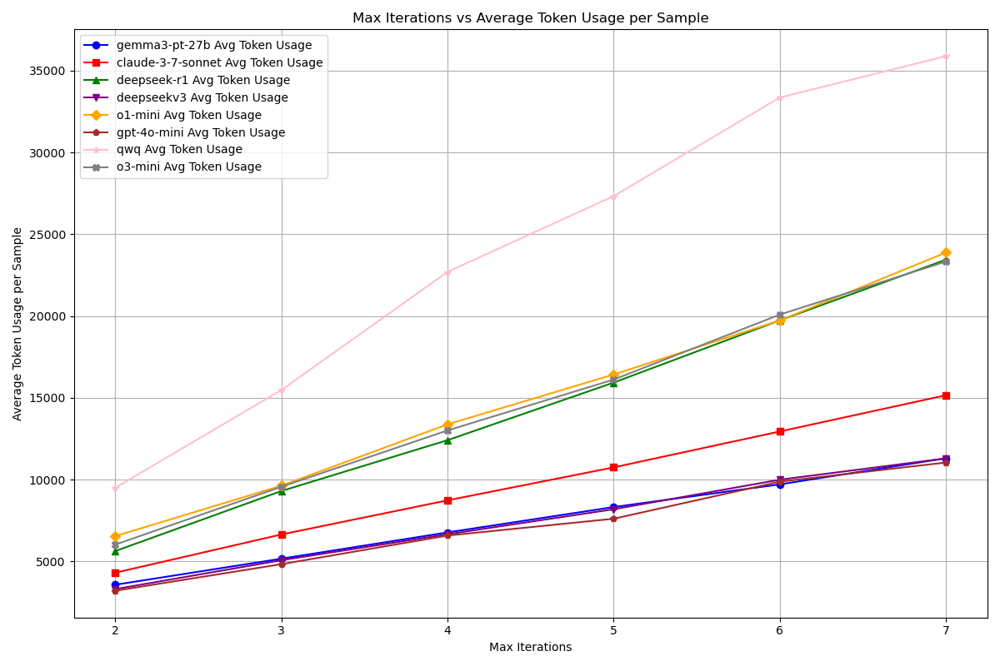

# Evaluation of DeepSearcher
## Introduction
DeepSearcher is very good at answering complex queries. In this evaluation introduction, we provide some scripts to evaluate the performance of DeepSearcher vs. naive RAG.

The evaluation is based on the Recall metric:

> Recall@K: The percentage of relevant documents that are retrieved among the top K documents returned by the search engine.

Currently, we support the multi-hop question answering dataset of [2WikiMultiHopQA](https://paperswithcode.com/dataset/2wikimultihopqa). More dataset will be added in the future.

## Evaluation Script
The main evaluation script is `evaluate.py`. 

Your can provide a config file, say `eval_config.yaml`, to specify the LLM, embedding model, and other provider and parameters.
```shell
python evaluate.py \
--dataset 2wikimultihopqa \
--config_yaml ./eval_config.yaml \
--pre_num 5 \
--output_dir ./eval_output
```
`pre_num` is the number of samples to evaluate, the more samples, the more accurate the results will be, but it will consume more time and your LLM api token usage.

After you have loaded the dataset into vectorDB in the first run, if you want to skip loading dataset again, you can set the flag `--skip_load` in the command line.

For more arguments details, you can run
```shell
python evaluate.py --help
```

## Evaluation Results  
We conducted tests using the commonly used 2WikiMultiHopQA dataset. (Due to the high consumption of API tokens for testing, we only tested the first 50 samples. This may introduce some fluctuations compared to testing the entire dataset, but it can still roughly reflect the general landscape of performance.)

### Recall Comparison between Naive RAG and DeepSearcher with Different Models
With Max Iterations on the horizontal axis and Recall on the vertical axis, the following chart compares the recall rates of Deep Searcher and naive RAG.

#### Performance Improvement with Iterations
As we can see, as the number of Max Iterations increases, the recall performance of Deep Searcher improves significantly. And all the model results from Deep Searcher are significantly higher than those from naive RAG.

#### Diminishing Returns
However, it is also evident that as the number of iterations gradually increases, the marginal gains decrease, indicating that there may be a certain limit reached after increasing the feedback iterations, and further feedback might not yield significantly better results.

#### Model Performance Comparison
Claude-3-7-sonnet (red line) demonstrates superior performance throughout, achieving nearly perfect recall at 7 iterations. Most models show significant improvement as iterations increase, with the steepest gains occurring between 2-4 iterations. Models like o1-mini (yellow) and deepseek-r1 (green) exhibit strong performance at higher iteration counts. Since our sample number for testing is limited, the results of each test may vary somewhat. 
Overall, reasoning models generally perform better than non-reasoning models. 

#### Limitations of Non-Reasoning Models
Additionally, in our tests, weaker and smaller non-reasoning models sometimes failed to complete the entire agent query pipeline, due to their inadequate instruction-following capabilities.

### Token Consumption
We plotted the graph below with the number of iterations on the horizontal axis and the average token consumption per sample on the vertical axis:  
  
It is evident that as the number of iterations increases, the token consumption of Deep Searcher rises linearly. Based on this approximate token consumption, you can check the pricing on your model provider's website to estimate the cost of running evaluations with different iteration settings.