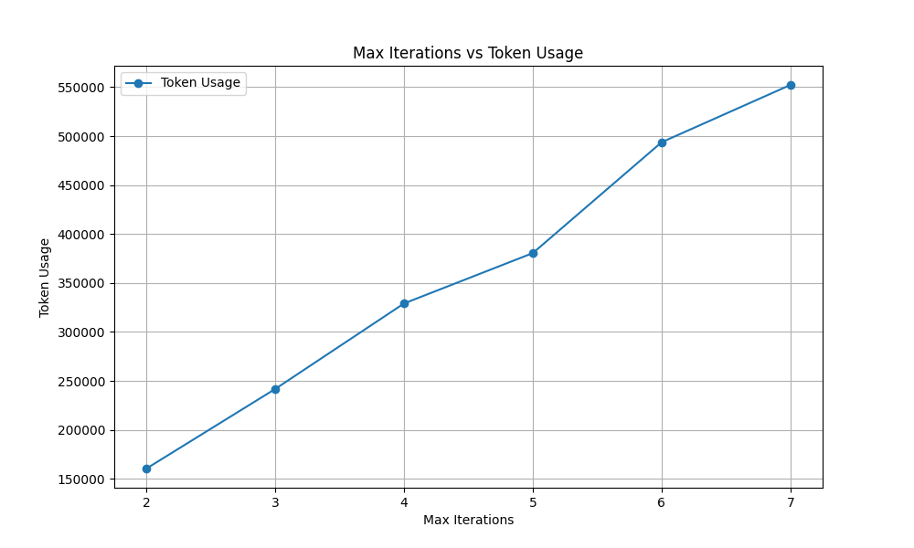
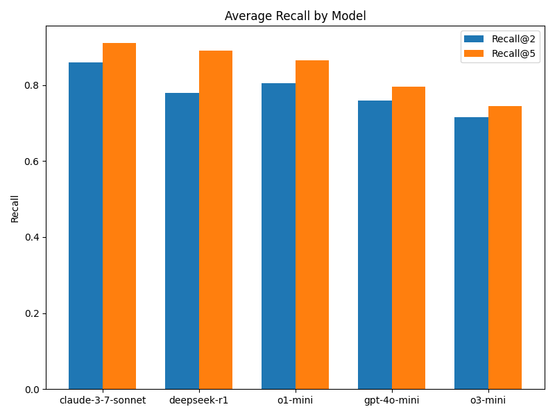

# Evaluation of DeepSearcher
## Introduction
DeepSearcher is very good at answering complex queries. In this evaluation introduction, we provide some scripts to evaluate the performance of DeepSearcher vs. naive RAG.

The evaluation is based on the Recall metric:

> Recall@K: The percentage of relevant documents that are retrieved among the top K documents returned by the search engine.

Currently, we support the multi-hop question answering dataset of [2WikiMultiHopQA](https://paperswithcode.com/dataset/2wikimultihopqa). More dataset will be added in the future.

## Evaluation Script
The main evaluation script is `evaluate.py`. 

Your can provide a config file, say `eval_config.yaml`, to specify the LLM, embedding model, and other provider and parameters.
```shell
python evaluate.py \
--dataset 2wikimultihopqa \
--config_yaml ./eval_config.yaml \
--pre_num 5 \
--output_dir ./eval_output
```
`pre_num` is the number of samples to evaluate, the more samples, the more accurate the results will be, but it will consume more time and your LLM api token usage.

After you have loaded the dataset into vectorDB in the first run, if you want to skip loading dataset again, you can set the flag `--skip_load` in the command line.

For more arguments details, you can run
```shell
python evaluate.py --help
```

## Evaluation Results  
We conducted tests using the commonly used 2WikiMultiHopQA dataset. (Due to the high consumption of API tokens for testing, we only tested the first 50 samples. This may introduce some fluctuations compared to testing the entire dataset, but it can still roughly reflect the general landscape of performance.)

### Comparison of Recall with naive RAG
With Max Iterations on the horizontal axis and Recall on the vertical axis, the following chart compares the recall rates of Deep Searcher and naive RAG.

As we can see, as the number of Max Iterations increases, the recall performance of Deep Searcher improves significantly. And all the results from Deep Searcher are significantly higher than those from naive RAG.

However, it is also evident that as the number of iterations gradually increases, the marginal gains decrease, indicating that there may be a certain limit reached after increasing the feedback iterations, and further feedback might not yield significantly better results.

### Token Consumption
We plotted the graph below with the number of iterations on the horizontal axis and the total token consumption over 50 iterations on the vertical axis:  
  
It is evident that as the number of iterations increases, the token consumption of Deep Searcher rises linearly. For 4 iterations, the token consumption is approximately 0.3M tokens. Roughly estimating based on OpenAI's GPT-4o-mini rate of $0.60 per 1M output tokens, the average cost per query would be around $0.18 / 50 = $0.0036.  

If we switch to a reasoning model, this cost would likely increase several times due to the higher base price of the reasoning model and the larger number of output tokens generated from it.

### Comparison Between Models

Compared to OpenAI's official DeepResearch, another notable feature of our Deep Searcher is the ability to switch between models freely. 

In this study, we also tested various reasoning models and non-reasoning models (such as gpt-4o-mini). 
It is evident that Claude 3.7 Sonnet performed the best, although the margin is not substantial. Of course, since our sample number for testing is limited, the results of each test may vary somewhat. 
Overall, reasoning models generally perform better than non-reasoning models. 

Additionally, in our tests, weaker and smaller non-reasoning models sometimes failed to complete the entire agent query pipeline, due to their inadequate instruction-following capabilities.
